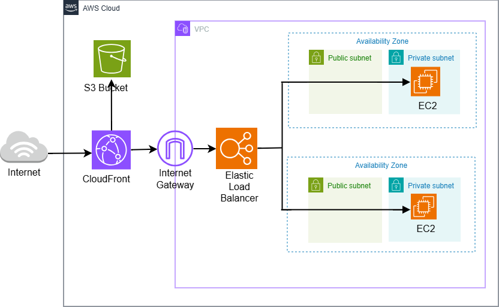

# AWS Portfolio Website Deployment

[](https://aws.amazon.com/)
[](https://ddj6jvqxzj0e2.cloudfront.net)
[](https://ddj6jvqxzj0e2.cloudfront.net)

Production-grade portfolio website deployment on AWS, showcasing the evolution from basic S3 static hosting to enterprise CloudFront CDN infrastructure.

**Live Site:** [https://ddj6jvqxzj0e2.cloudfront.net](https://ddj6jvqxzj0e2.cloudfront.net)

---

## Project Overview

This project documents the deployment and infrastructure evolution of my portfolio website, demonstrating cloud architecture best practices and AWS service integration.

### Infrastructure Evolution

**Phase 1: Basic S3 Static Hosting**
- Initial deployment using S3 static website hosting
- Public bucket with website endpoint
- HTTP-only access
- Direct S3 URL exposure

**Phase 2: Production CloudFront Distribution** *Current*
- CloudFront CDN with global edge locations
- HTTPS/TLS encryption
- Origin Access Control (OAC) for S3 security
- Private S3 bucket (no direct access)
- Custom error pages
- Cache optimization

---

## Architecture

### Current Production Architecture



### Security Model

```
Internet → CloudFront (HTTPS) 
CloudFront → S3 (OAC authorized) 
Internet → S3 Direct (403 Forbidden - by design)
```

---

## Technologies Used

- **AWS S3** - Object storage for static files
- **AWS CloudFront** - Content Delivery Network
- **AWS IAM** - Identity and Access Management
- **Origin Access Control (OAC)** - S3 security
- **HTTPS/TLS** - Encrypted connections
- **HTML5, CSS3, JavaScript** - Frontend technologies

---

## Key Features

### Performance
- Global CDN with 40+ edge locations
- Reduced latency via edge caching
- Gzip/Brotli compression
- Browser caching optimization

### Security
- HTTPS/TLS 1.2+ encryption
- Origin Access Control (OAC)
- Private S3 bucket
- No direct S3 access (403 by design)
- IAM least-privilege policies

### Reliability
- Multi-region edge distribution
- CloudFront automatic failover
- 99.9% SLA uptime
- Cache invalidation for updates

---

## Deployment Process

### Initial S3 Setup
```bash
# Create S3 bucket
aws s3 mb s3://thato-portfolio-website

# Upload website files
aws s3 sync ./portfolio s3://thato-portfolio-website

# Configure static website hosting
aws s3 website s3://thato-portfolio-website --index-document index.html
```

### CloudFront Migration
```bash
# Create CloudFront distribution (via AWS Console)
# - Origin: S3 bucket
# - Origin Access Control: Enabled
# - Viewer Protocol: Redirect HTTP to HTTPS
# - Cache Policy: CachingOptimized

# Update S3 bucket policy for OAC access
# Make bucket private (remove public access)

# Invalidate cache after updates
aws cloudfront create-invalidation \
  --distribution-id EHME5K7ZEE2U3 \
  --paths "/*"
```

---

## What I Learned

### AWS Services
- S3 static website hosting vs CloudFront distribution
- Origin Access Control (OAC) vs Origin Access Identity (OAI)
- CloudFront cache behaviors and invalidation
- IAM policies for service-to-service access
- SSL/TLS certificate management

### Infrastructure Concepts
- Content Delivery Networks (CDNs)
- Edge location caching strategies
- Security through obscurity vs. actual security
- Why 403 errors can indicate proper security
- Production vs. development deployment patterns

### DevOps Practices
- Infrastructure documentation
- Deployment workflows
- Cache invalidation strategies
- Cost optimization (S3 + CloudFront pricing)

---

## Cost Analysis

### Monthly Costs (Estimated)
- **S3 Storage:** ~$0.50 (for 20GB)
- **S3 Requests:** ~$0.05
- **CloudFront Data Transfer:** ~$2.00 (first 1TB free tier)
- **Total:** ~$2.55/month

### Free Tier Benefits
- CloudFront: 1TB data transfer out free (12 months)
- S3: 5GB storage free (12 months)
- CloudFront: 10M HTTP/HTTPS requests free (12 months)

---

## Update Workflow

```bash
# 1. Update local files
# Edit HTML/CSS/JS locally

# 2. Upload to S3
aws s3 cp index.html s3://thato-portfolio-website/index.html

# 3. Invalidate CloudFront cache
aws cloudfront create-invalidation \
  --distribution-id EHME5K7ZEE2U3 \
  --paths "/*"

# 4. Wait 1-2 minutes for propagation
# 5. Verify changes live
```

---

## Configuration Files

### S3 Bucket Policy (CloudFront OAC Access)
```json
{
  "Version": "2012-10-17",
  "Statement": [
    {
      "Sid": "AllowCloudFrontServicePrincipal",
      "Effect": "Allow",
      "Principal": {
        "Service": "cloudfront.amazonaws.com"
      },
      "Action": "s3:GetObject",
      "Resource": "arn:aws:s3:::thato-portfolio-website/*",
      "Condition": {
        "StringEquals": {
          "AWS:SourceArn": "arn:aws:cloudfront::274588776691:distribution/EHME5K7ZEE2U3"
        }
      }
    }
  ]
}
```

---

## Future Enhancements

- [ ] Custom domain name (Route 53)
- [ ] SSL certificate for custom domain
- [ ] CI/CD pipeline (GitHub Actions)
- [ ] Automated deployments on push
- [ ] CloudWatch monitoring and alerts
- [ ] Lambda@Edge for dynamic content
- [ ] A/B testing with CloudFront

---

## Resources & References

- [AWS S3 Static Website Hosting](https://docs.aws.amazon.com/AmazonS3/latest/userguide/WebsiteHosting.html)
- [CloudFront Developer Guide](https://docs.aws.amazon.com/AmazonCloudFront/latest/DeveloperGuide/)
- [Origin Access Control (OAC)](https://docs.aws.amazon.com/AmazonCloudFront/latest/DeveloperGuide/private-content-restricting-access-to-s3.html)
- [AWS Well-Architected Framework](https://aws.amazon.com/architecture/well-architected/)

---

## Author

**Thato Rapholo**
- Portfolio: [https://ddj6jvqxzj0e2.cloudfront.net](https://ddj6jvqxzj0e2.cloudfront.net)
- LinkedIn: [linkedin.com/in/thato-rapholo](https://www.linkedin.com/in/thato-rapholo/)
- GitHub: [@Trapholo01](https://github.com/Trapholo01)

---

## 📄 License

This project is for educational purposes.

---

## Acknowledgments

Built as part of CAPACITI's Cloud & DevOps training program, following AWS best practices and the Well-Architected Framework.
